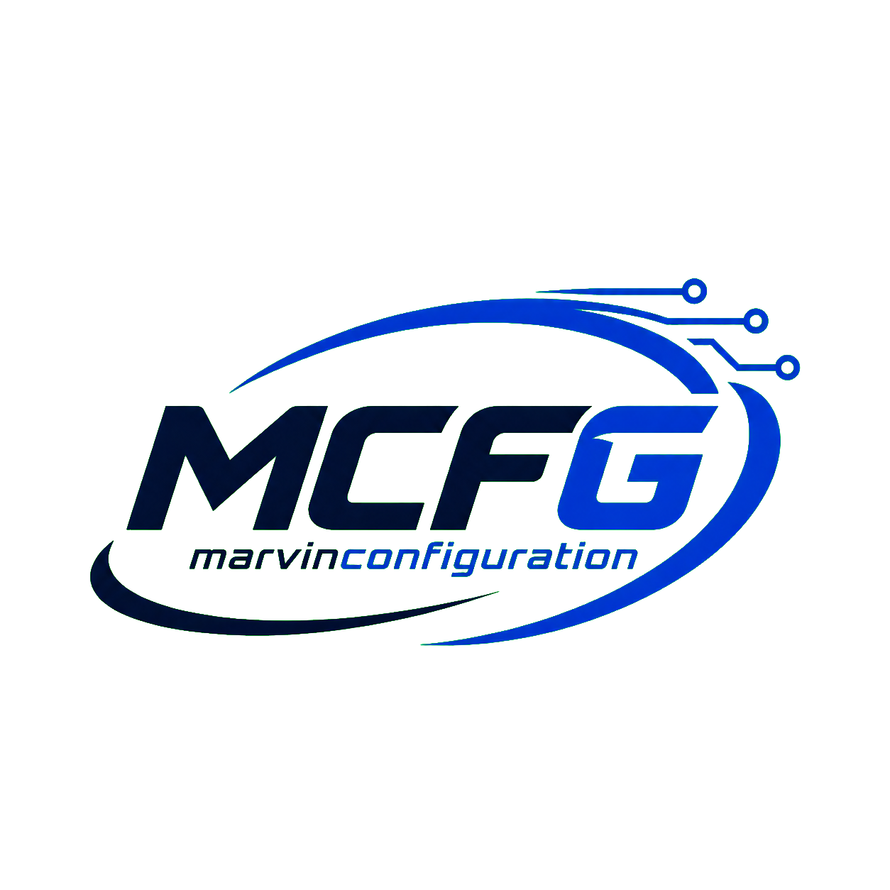

<!doctype html>
<html lang="en">
<head>
  <meta charset="utf-8">
  <meta name="viewport" content="width=device-width, initial-scale=1">
  <meta name="description" content="MarvinConfiguration — MikroTik, multi-ISP, network security, automation, OLT, centralized WiFi and remote access solutions.">
  <title>MarvinConfiguration | Network Solutions & Support</title>
  
  
</head>
<body>
  <!-- DIRECT LINKS: Palitan lamang ang href="..." values sa mga <a> tag. -->
  <header class="wrap">
    <nav class="nav" aria-label="Main navigation">
      <a class="compact-brand" href="#top" aria-label="MarvinConfiguration home"><strong>MCFG</strong><small>Marvin Configuration</small></a>
      
<a href="#services">Services</a><a href="#solutions">Solution</a><a href="#faq">FAQ</a>

      
<button class="theme-toggle" type="button" aria-label="Switch color theme" title="Light / Dark mode">☀☾</button><a class="btn btn-primary message-pill" href="https://m.me/YOUR_PAGE_USERNAME">Message Me →</a><button class="mobile-menu" type="button" aria-label="Open menu" aria-expanded="false">☰</button>

    </nav>
    
<a href="#services">Services</a><a href="#solutions">Solution</a><a href="#faq">FAQ</a><a href="https://m.me/YOUR_PAGE_USERNAME">Message Me</a>

  </header>

  <main id="top">
    <section class="hero">

<i class="dot"></i>Professional MikroTik & Network Solutions<h1>Smarter networks. Reliable connections.</h1>
MarvinConfiguration delivers multi-ISP routing, MikroTik automation, security, OLT and centralized WiFi solutions—with remote support that makes troubleshooting faster and hassle-free.

<a class="btn btn-primary message-pill" href="https://m.me/YOUR_PAGE_USERNAME">Message Me →</a><a class="btn btn-outline" href="#services">View Services</a>

<b>4.9</b>★★★★★From configuration to lifetime support

<i></i><i></i><i></i>Featured Configurations

<small>MULTI-ISP SETUP</small><strong style="color:#2b72f7">PCC / Failover</strong>

<small>NETWORK SECURITY</small><strong style="color:#1fbd69">Protected</strong>

<small>REMOTE SUPPORT</small><strong>Available</strong>

</section>

    <section class="numbers">

<i class="metric-icon device-symbol metric-isp" aria-hidden="true"></i><strong>Multi-ISP</strong>Load Balance & Failover

<i class="metric-icon device-symbol metric-router" aria-hidden="true"></i><strong>MikroTik</strong>Routing & Automation

<i class="metric-icon device-symbol metric-olt" aria-hidden="true"></i><strong>OLT</strong>Configuration & VLAN

<i class="metric-icon">♡</i><strong>Lifetime</strong>Technical Support

</section>

    <section class="section" id="services">

What I configure<h2>Complete network solutions</h2>
Practical, secure and support-ready configurations for ISPs, WISPs, businesses and network operators.

<article class="feature">
⇄
<h3>Multi-ISP & Routing</h3><ul><li>Dual / Multi ISP</li><li>LB PCC / PBR</li><li>Auto-Failover / Recursive</li><li>OSPF Core to AC’s</li></ul></article><article class="feature">
⌁
<h3>Subscriber Access & Automation</h3><ul><li>PPPoE / IPoE / DHCP / Hotspot</li><li>PPPoE auto-expired scheduler</li><li>Payment reminder dynamic</li><li>VPN remote MT / OLT / client / vendo</li></ul></article><article class="feature">
⚡
<h3>Performance Optimization</h3><ul><li>Gaming priority</li><li>Bandwidth shaping</li><li>Speed bursting</li><li>Bypass speedtest</li></ul></article><article class="feature">
🛡
<h3>Network Security</h3><ul><li>Client security configuration</li><li>Secure Winbox access</li><li>Anti-Porn filtering</li><li>Starlink filters & protection</li></ul></article><article class="feature">
◈
<h3>OLT & Centralization</h3><ul><li>OLT configuration / Multi VLAN</li><li>JuanFi centralized</li><li>WiFi5-Soft centralized</li><li>MikroTik auto-backup via Gmail</li></ul></article><article class="feature">
☁
<h3>Starlink & Traffic Control</h3><ul><li>Anti-Stow</li><li>Anti-Sleep</li><li>Anti-Torrent</li><li>Anti-High Downloads</li></ul></article>

</section>

    <section class="section pricing" id="solutions">

Built for real operations<h2>Solutions that keep you connected</h2>
Each setup is tailored to your topology, subscribers, bandwidth goals and security requirements.

<article class="plan">Reliability<h3>Multi-ISP Continuity</h3>
Keep your network running even when one ISP goes down.
<ul><li>PCC / PBR load balancing</li><li>Recursive failover</li><li>Route monitoring</li><li>Clean recovery behavior</li></ul><a class="btn btn-outline" href="https://m.me/YOUR_PAGE_USERNAME">Ask About Setup</a></article><article class="plan popular">FeaturedComplete solution<h3>VPN + Login Portal</h3>
Remote management and customer account control in one portal.
<ul><li>Online / offline monitoring</li><li>Expiration tracking</li><li>Enable / disable accounts</li><li>Edit client / server names</li></ul><a class="btn btn-primary" href="https://mcfgcloud.com/login">Open Portal</a></article><article class="plan">Performance<h3>Traffic Optimization</h3>
Make bandwidth usage fair, responsive and gaming-friendly.
<ul><li>Gaming priority</li><li>Bandwidth shaping</li><li>Speed bursting</li><li>Traffic filtering</li></ul><a class="btn btn-outline" href="https://m.me/YOUR_PAGE_USERNAME">Ask About Setup</a></article><article class="plan" id="payment-reminder">Automation<h3>Payment Reminder System</h3>
Reduce repetitive work and make account management easier.
<ul><li>Dynamic payment reminders</li><li>Auto-expiry scheduler</li><li>Automatic backups</li><li>Lifetime support</li></ul><a class="btn btn-outline" href="https://m.me/YOUR_PAGE_USERNAME">Ask About Setup</a></article>

</section>

    <section class="section" id="portal">

VPN Remote Access + Login Portal<h2>Manage your network even when you’re off-site</h2>
A practical portal solution that helps you see account status, handle basic controls and troubleshoot concerns faster.
<ul class="checks"><li>Monitor online / offline status</li><li>Check account expiration dates</li><li>Enable or disable an account</li><li>Edit client and server names</li><li>Remote access kahit wala ka sa site</li></ul><a class="btn btn-primary" href="https://mcfgcloud.com/login">Open Login Portal →</a>

MT
<b>MikroTik Core Router</b><small>Remote management ready</small>
Online

OLT
<b>OLT Infrastructure</b><small>Remote configuration access</small>
Online

CPE
<b>Client / Vendo Devices</b><small>Faster remote troubleshooting</small>
Ready

</section>

    <section class="section" id="faq">

FAQ<h2>Frequently asked questions</h2>

Can you configure an existing MikroTik setup?

Yes. The configuration can be reviewed and improved based on your current topology and goals.

Do you support dual or multiple ISP connections?

Yes. Available options include PCC, PBR, recursive routing and automatic failover.

Can you help remotely?

Yes. Secure remote access can make configuration and troubleshooting possible even when you are off-site.

Do you configure OLT and centralized WiFi systems?

Yes. Services include OLT multi-VLAN, JuanFi centralized and WiFi5-Soft centralized configurations.

Is support included after setup?

Lifetime support is available so you can ask for guidance when concerns arise.

</section>

    <section class="cta">

<h2>Gawing mas madali ang network setup mo</h2>
DM mo lang ako—tutulungan kitang gumawa ng reliable, secure at hassle-free na configuration.
<a class="btn btn-primary" href="https://m.me/YOUR_PAGE_USERNAME">Message MarvinConfiguration →</a>

</section>
  </main>

  <footer>
<a class="compact-brand" href="#top" aria-label="MarvinConfiguration home"><strong>MCFG</strong><small>Marvin Configuration</small></a>
<a href="#services">Services</a><a href="#solutions">Solutions</a><a href="https://mcfgcloud.com/login">VPN Portal</a><a href="https://m.me/YOUR_PAGE_USERNAME">Message Me</a>
© 2026 MarvinConfiguration. All rights reserved.
</footer>
  
</body>
</html>
